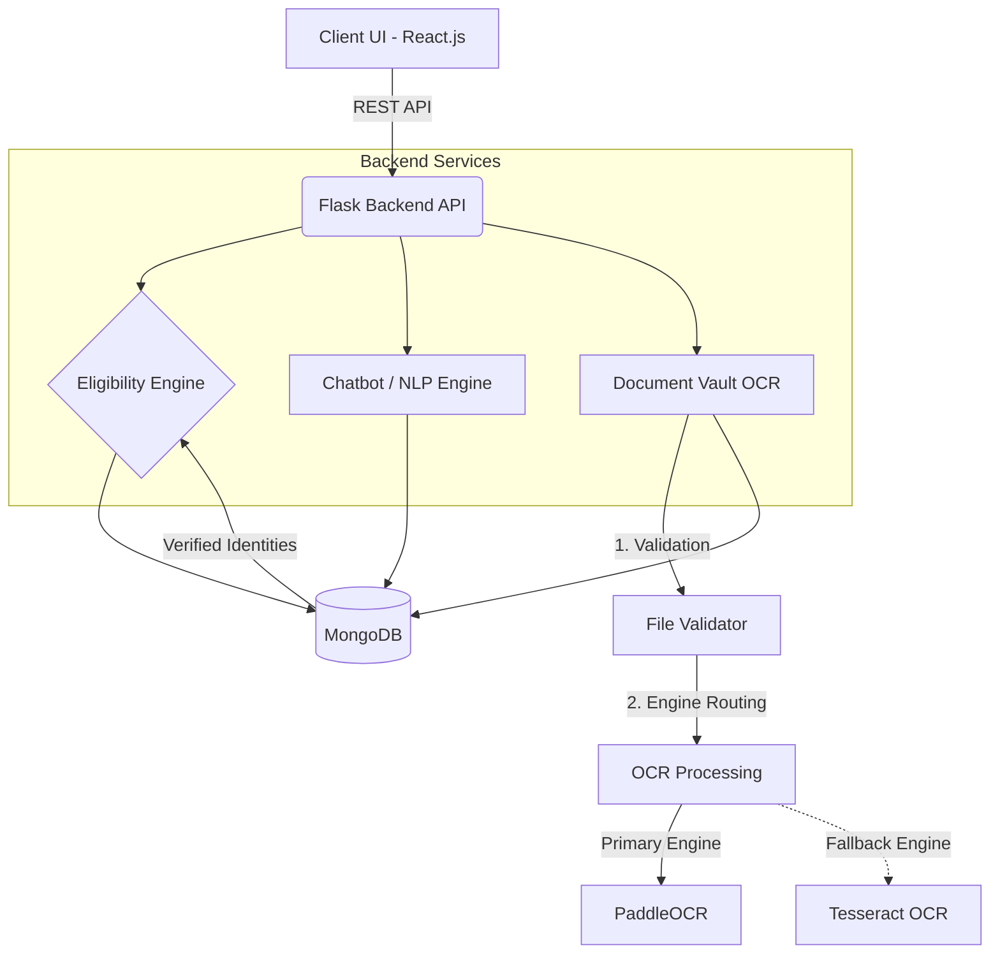
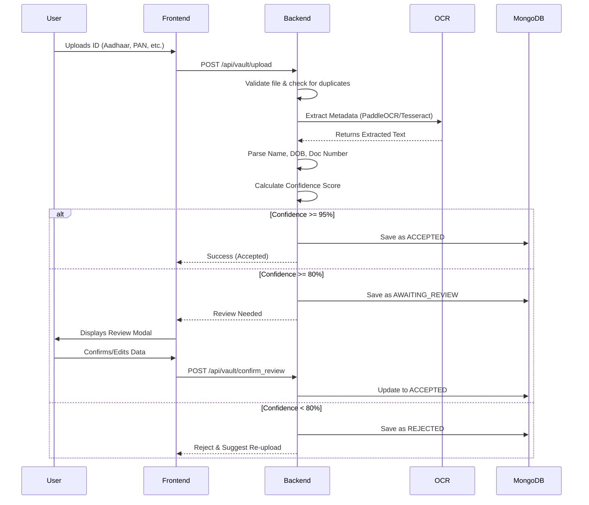

# SATYA - Multilingual AI-Based System for Government Scheme Eligibility

**SATYA** (System for AI-based Transparency and Yielding Assistance) is an intelligent web-based platform designed to bridge the awareness gap surrounding government schemes in India. It enables users to discover eligible welfare schemes through a rule-based engine and a powerful, multilingual AI chatbot, backed by a fully automated Document Vault for secure identity verification.

---

## 🏗️ Project Architecture



---

## 🛠️ Technology Stack

### Frontend

- **React.js** (Vite)
- **i18next** for real-time 9-language localization
- **Lucide React** for premium iconography
- **Framer Motion** for micro-animations and smooth UI transitions
- **Vanilla CSS** with a custom design system & glassmorphic layouts

### Backend

- **Python Flask** REST API
- **PaddleOCR** & **Tesseract** for intelligent document extraction
- **PyMuPDF / pdf2image** for handling digital and scanned PDFs
- **MongoDB** for scheme, FAQ data, and document vault metadata
- **GoogleTrans** & **LangDetect** for real-time translation logic
- **JWT & bcrypt** for secure user authentication

---

## 📂 Folder Structure

```
SATYA/
├── frontend/                   # React application
│   ├── src/
│   │   ├── components/         # UI Components
│   │   │   ├── Navbar.jsx                  # Navigation bar
│   │   │   ├── FloatingChatbot.jsx         # AI-powered chatbot
│   │   │   ├── DocumentVerification.jsx    # Document verification UI
│   │   │   ├── OTPVerificationModal.jsx    # OTP verification modal
│   │   │   ├── DocumentReviewModal.jsx     # Review extracted data
│   │   │   └── ImageSlider.jsx             # Image carousel
│   │   ├── pages/              # Main App Pages
│   │   │   ├── LandingPage.jsx
│   │   │   ├── Login.jsx
│   │   │   ├── Register.jsx
│   │   │   ├── EligibilityForm.jsx
│   │   │   ├── DocumentVault.jsx
│   │   │   ├── AadhaarVerification.jsx
│   │   │   ├── DocumentVerification.jsx
│   │   │   ├── AdminDashboard.jsx
│   │   │   ├── AdminDiagnostics.jsx
│   │   │   └── SchemeList.jsx
│   │   ├── i18n.js             # Localization Config (9 languages)
│   │   └── index.css           # Design System & Tokens
│   ├── package.json
│   ├── vite.config.js
│   └── README.md
├── backend/                    # Flask API
│   ├── routes/                 # API Endpoints
│   │   ├── auth.py             # Authentication (register, login)
│   │   ├── otp_routes.py       # OTP & 2FA
│   │   ├── verification.py     # Identity verification
│   │   ├── chatbot.py          # NLP chatbot
│   │   ├── schemes.py          # Scheme management
│   │   ├── eligibility_routes.py    # Eligibility calculation
│   │   ├── vault_routes.py     # Document vault operations
│   │   ├── admin.py            # Admin panel
│   │   ├── scraper_status.py   # Scheme scraper
│   │   └── translator_utils.py # Translation utilities
│   ├── vault/                  # Document Processing Engine
│   │   ├── ocr_engine.py       # Core OCR processor
│   │   ├── ocr_utils.py        # OCR utilities (PaddleOCR + Tesseract)
│   │   ├── document_vault.py   # Vault operations
│   │   ├── document_manager.py # Document lifecycle management
│   │   ├── field_extractor.py  # Extract fields from OCR
│   │   ├── identity_matcher.py # Identity verification logic
│   │   ├── duplicate_detector.py    # Fraud detection
│   │   ├── quality_detector.py      # Document quality assessment
│   │   ├── learning_pipeline.py     # Continuous ML improvement
│   │   ├── security.py         # Payload sealing & encryption
│   │   ├── verification_orchestrator.py  # Verification workflow
│   │   ├── verifiers/          # Document-type-specific logic
│   │   └── audit.py            # Audit trail logging
│   ├── document_intelligence/  # AI-powered document processing
│   │   ├── ocr_pipeline.py
│   │   ├── classification.py   # Document type classification
│   │   ├── layout.py           # Layout analysis
│   │   ├── field_mapping.py
│   │   ├── augmentation.py
│   │   └── orchestrator.py
│   ├── services/               # Utility services
│   │   └── otp_service.py      # OTP generation and sending
│   ├── scripts/                # Setup & maintenance
│   │   ├── create_admin.py     # Admin user setup
│   │   └── validate_real_documents.py
│   ├── tests/                  # Test suite
│   │   ├── test_ocr_classification_and_extraction.py
│   │   ├── test_document_upload_validation.py
│   │   ├── test_vault_upload_route.py
│   │   ├── test_vault_utils_import.py
│   │   └── test_identity_lock.py
│   ├── data/                   # Persistent JSON & Cache
│   │   ├── faqs_expanded.json
│   │   └── translation_cache.json
│   ├── app.py                  # Entry Point
│   ├── database.py             # MongoDB Connection
│   ├── seed.py                 # Database seeding
│   ├── scheme_scraper.py       # Automated scheme scraper
│   ├── requirements.txt
│   └── README.md
├── uploads/                    # Secure local document storage
├── vault_storage/              # Vault document archive
├── vault_thumbnails/           # Document previews
├── temp_uploads/               # Temporary file processing
└── README.md
```

---

## 🔍 OCR Pipeline

The OCR pipeline in the **Document Vault** operates through a highly resilient, multi-stage process to extract user identity details:

1. **Upload & Validation**: Validates file types (JPG, JPEG, PNG, PDF), enforces file size limits, and securely saves the file.
2. **Preprocessing**: PDFs are automatically converted into optimal image formats. Images are resized and normalized for maximum OCR accuracy.
3. **Primary Extraction (PaddleOCR)**: The primary, high-accuracy deep learning OCR engine runs.
4. **Fallback Extraction (Tesseract)**: If PaddleOCR returns no text or low confidence, Tesseract OCR triggers automatically.
5. **Entity Recognition**: Uses document-specific regex parsers (e.g., Aadhaar vs PAN) to cleanly extract `Name`, `DOB`, `Gender`, and `Document Number`.
6. **Confidence Scoring**: Heuristic confidence is calculated based on which vital fields were found and how cleanly they matched the templates.

---

## 📄 Document Processing Workflow



---

## 🎯 Eligibility Workflow

The Eligibility Workflow uses the **Document Vault** to securely vet users before determining their eligibility for government schemes:

1. **Identity Gate**: When a user accesses the eligibility engine, it checks if the user has verified their identity through the Document Vault.
2. **Verified Match**: If the user submits personal details (Name, DOB, State), the backend dynamically compares these against the `sealed_payload` of their accepted documents.
3. **Match Breakdown**: If there is a mismatch (e.g., a spelling difference in the name or mismatched DOB), the engine surfaces a detailed **Identity Match Breakdown**, showing exactly which fields failed the threshold check.
4. **Scheme Processing**: If the identity is verified, the rules-engine cross-references their attributes (Age, Income, Caste, Gender, State) against the database of government schemes and returns customized results.

---

## 🔌 API Endpoints List

### Authentication

- `POST /api/auth/register` - Create a new user
- `POST /api/auth/login` - Authenticate user

### OTP & Verification

- `POST /api/otp/send` - Send OTP to user email
- `POST /api/otp/verify` - Verify OTP for two-factor authentication
- `POST /api/verification/submit` - Submit identity verification details

### Scheme Engine

- `POST /api/schemes/eligible` - Calculate eligible schemes based on profile
- `GET /api/schemes/categories` - Fetch scheme categories
- `GET /api/schemes/` - Fetch all schemes

### Chatbot

- `POST /api/chatbot/message` - Send query and get multilingual NLP response
- `GET /api/chatbot/suggestions` - Get suggested chat questions

### Document Vault

- `POST /api/vault/upload` - Securely upload and run OCR on a document
- `POST /api/vault/confirm_review` - Approve or correct an `AWAITING_REVIEW` document
- `GET /api/vault/` - Get all documents for a user
- `DELETE /api/vault/<doc_id>` - Delete a document and its resources
- `GET /api/vault/identity` - Check combined verification status
- `GET /api/vault/analytics` - Fetch processing times, engine usage, and success rates
- `GET /api/vault/health` - Check OCR engine status

### Admin Panel

- `GET /api/admin/dashboard-stats` - Fetch platform analytics and statistics
- `POST /api/admin/add-scheme` - Add a new government scheme to the database
- `DELETE /api/admin/delete-scheme/<scheme_id>` - Remove a scheme
- `PUT /api/admin/update-scheme/<scheme_id>` - Update scheme details

### Scheme Scraper

- `GET /api/scraper/status` - Check the status of the scheme scraper job

---

## 🗄️ Database Schema (MongoDB)

### Users Collection

- `_id`, `email`, `password`, `name`, `created_at`

### Schemes Collection

- `_id`, `name`, `description`, `category`, `benefits`, `eligibility_criteria` (Age, Income, Gender, Caste, State)

### Vault Documents Collection

- `user_id`: Reference to user
- `filename`, `file_path`, `document_type`, `upload_date`
- `verification_status`: Enum (`Processing`, `Accepted`, `Awaiting Review`, `Rejected`)
- `sealed_payload`: Immutable object containing the final verified Name, DOB, Gender, and ID Number.
- `ocr_metadata`: Internal tracking (Engine used, processing time, confidence score).

---

## ⚙️ Installation Steps

### Prerequisites

- Node.js (v18+)
- Python (v3.10+)
- MongoDB (Running on `localhost:27017`)
- PaddlePaddle/PaddleOCR dependencies (C++ Build Tools for Windows)

### 1. Backend Setup

```bash
cd backend
python -m venv venv
# Windows:
.\venv\Scripts\activate
# Mac/Linux:
source venv/bin/activate

# Install dependencies (may take time for PaddleOCR)
pip install -r requirements.txt
```

### 2. Frontend Setup

```bash
cd frontend
npm install
npm run dev
```

### 3. Run the Application

**Backend**:

```bash
cd backend
python app.py
```

**Frontend**:

```bash
cd frontend
npm run dev
```


### 2. Frontend Setup

```bash
cd frontend
npm install
npm run dev
````

_Access the platform at `http://localhost:5173`._

---

## ✨ Key Features

### 🔐 Two-Factor Authentication (OTP)

- Email-based OTP verification for enhanced security
- Integrates with user authentication workflow
- Configurable via environment variables (MAIL_SERVER, MAIL_USERNAME, etc.)

### 👨‍💼 Admin Dashboard

- Real-time platform analytics and statistics
- Scheme management (add, update, delete schemes)
- User activity monitoring
- System diagnostics and performance tracking

### 🤖 Automated Scheme Scraper

- Automatic web scraping of government schemes
- Background job processing for continuous data updates
- Status tracking and health monitoring

### 🆔 Multi-Document Identity Verification

- Support for multiple identity documents: Aadhaar, PAN, Passport, Driving License, etc.
- Document-specific regex parsing and validation
- Duplicate document detection to prevent fraud
- Learning pipeline for continuous OCR improvement

---

## 🧪 Testing

Run the test suite to validate the application:

```bash
cd backend

# Run all tests
python -m pytest tests/

# Run specific test
python -m pytest tests/test_ocr_classification_and_extraction.py

# Run with coverage
python -m pytest --cov=./
```

Key test files:

- `test_ocr_classification_and_extraction.py` - OCR engine validation
- `test_document_upload_validation.py` - Document upload workflow
- `test_vault_upload_route.py` - Vault API endpoint testing
- `test_identity_lock.py` - Identity verification logic

---

## 📸 Screenshots

_(To be added: DocumentVault Dashboard, Review Modal, Diagnostics Page, and Scheme Matcher)_

---

## ⚠️ Known Limitations

- **PDF Processing Overhead**: Scanned PDFs are memory intensive as they must be rasterized to images before OCR processing. Processing times for large PDFs scale linearly per page.
- **PaddleOCR Cold Start**: On the very first upload, PaddleOCR lazily loads its neural network models into memory, causing the first document to take an additional ~1.5s to process.
- **Hardware Dependency**: Without a CUDA-compatible GPU, PaddleOCR defaults to CPU processing which is noticeably slower on older machines.

---

---

## 👨‍💻 Author

**Shivam Pajiyar**

- Artificial Intelligence & Data Science Student
- CMR Institute of Technology, Bengaluru
- 📧 Email: shpa23ainds@cmrit.ac.in
- 🐙 GitHub: https://github.com/shivampajiyar29

---

## 🛡️ License

This project is licensed under the **MIT License**.

See the [LICENSE](LICENSE) file for details.

Copyright (c) 2026 Shivam Pajiyar

Permission is hereby granted, free of charge, to any person obtaining a copy of this software and associated documentation files (the "Software"), to deal in the Software without restriction, including without limitation the rights to use, copy, modify, merge, publish, distribute, sublicense, and/or sell copies of the Software, and to permit persons to whom the Software is furnished to do so, subject to the following conditions:

The above copyright notice and this permission notice shall be included in all copies or substantial portions of the Software.

THE SOFTWARE IS PROVIDED "AS IS", WITHOUT WARRANTY OF ANY KIND, EXPRESS OR IMPLIED, INCLUDING BUT NOT LIMITED TO THE WARRANTIES OF MERCHANTABILITY, FITNESS FOR A PARTICULAR PURPOSE AND NONINFRINGEMENT. IN NO EVENT SHALL THE AUTHORS OR COPYRIGHT HOLDERS BE LIABLE FOR ANY CLAIM, DAMAGES OR OTHER LIABILITY, WHETHER IN AN ACTION OF CONTRACT, TORT OR OTHERWISE, ARISING FROM, OUT OF OR IN CONNECTION WITH THE SOFTWARE OR THE USE OR OTHER DEALINGS IN THE SOFTWARE.
pip install -r requirements.txt

# Seed the database

python seed.py

# Start the Flask Server on port 5000

python app.py

````
